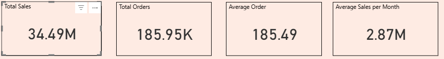
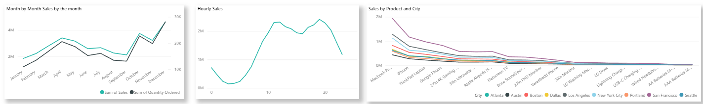
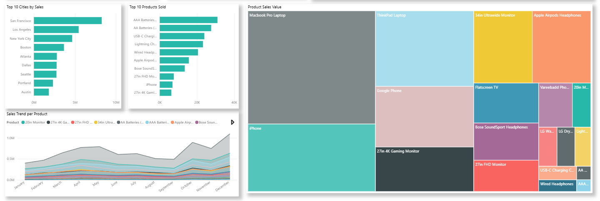

# Sales Insight360

**Sales Insight360** is a business intelligence project focused on transforming raw retail sales data into actionable insights through interactive dashboards. It highlights expertise in SQL, Excel, and Power BI for data cleaning, structuring, and visual analytics that support strategic decision-making.

## Project Overview

This project involves:
- Cleaning and transforming sales data using SQL
- Structuring and validating data with Excel
- Building an interactive Power BI dashboard for business insights

---

## Power BI Dashboard Features

- **KPI Cards**:  
  - Total Sales  
  - Total Orders  
  - Average Order Value

- **Sales Trends**:  
  - Line Chart: Month vs Sales  
  - Line Chart: Hour vs Sales

- **Product Insights**:  
  - Bar Chart: Product vs Total Sales  
  - Bar Chart: Product vs Quantity Ordered  
  - Clustered Bar Chart: Product vs Sales by City

- **Customer Behavior**:  
  - Line Chart: Orders by Hour  
  - Heatmap: Hour vs Day of Week vs Orders

- **Geo Analysis**:  
  - Map Chart: City-Wise Sales Distribution  
  - Bar Chart: City vs Total Sales

- **Filters**:  
  - City  
  - Month  
  - Year

---

## Technologies Used

- **SQL**: Data cleaning, transformation, and aggregation  
- **Excel**: Data validation and summary preparation  
- **Power BI**: Dashboard development and visualization

---

## Project Goals

- **Retail Insights**: Visualize key sales metrics by product, region, and time  
- **Trend Analysis**: Monitor monthly and hourly sales patterns  
- **User-Driven Exploration**: Enable stakeholders to filter and explore data dynamically

---

## Sample Dashboard Screenshots

  
*Figure 1: KPI Cards for Total Sales, Orders, and Average Order Value.*

  
*Figure 2: Sales trends over time (Month vs Sales).*

  
*Figure 3: Product Performance.*

---
